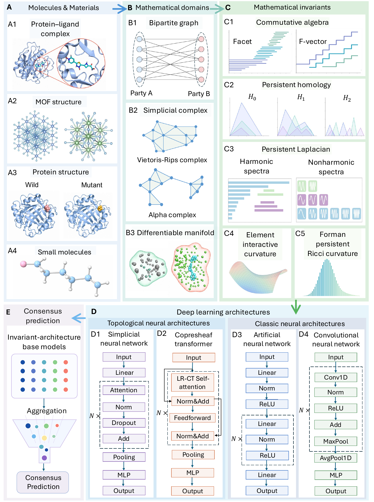

# MINTNN

## Overview

**MINTNN** is a molecular and materials learning framework for studying how multiscale mathematical invariant representations interact with neural processing mechanisms. It maps three-dimensional molecular and materials structures to mathematical domains such as bipartite graphs, simplicial complexes, and differentiable manifolds; constructs complementary invariant families including persistent homology, persistent Laplacian, commutative-algebraic descriptors, element-interactive curvature, and Forman persistent Ricci curvature; and pairs these features with ANN, CNN, SNN, and CTNN architectures. This release focuses on the MOF gas-uptake and LD50 toxicity applications, including precomputed features, final component settings, training scripts, and consensus utilities.

<p align="center">
  
</p>

## Repository Structure

```text
MINTNN/
|-- applications/
|   |-- ld50/              # LD50 toxicity component training scripts
|   |-- mof/               # MOF gas-uptake component training scripts
|   `-- common/            # Shared neural-network modules
|-- assets/                # Workflow figure used by the README
|-- configs/               # Application-level component and consensus settings
|-- data/                  # Feature manifest and expected downloaded feature layout
|-- docs/                  # Additional notes on data, features, architectures, and environment
|-- metadata/              # Machine-readable final model settings and reported metrics
|-- scripts/               # Training dispatcher, evaluation, consensus, and audit utilities
|-- src/mintnn/            # Reusable architecture definitions
|-- environment.yml
|-- requirements.txt
`-- README.md
```

## Precomputed Feature Download

The released feature archives are hosted on Google Drive:

[MINTNN final feature archives](https://drive.google.com/drive/folders/1Y5hwU1WikPbT5pzhIL0ocmJcf9MWE1mv)

The folder is expected to contain:

```text
MINTNN_MOF_final_features.zip
MINTNN_LD50_final_features.zip
```

A concise manifest of the released feature groups is provided in:

```text
data/feature_manifest.csv
```

The feature archives are intentionally not stored directly in the Git repository because they are large generated artifacts.

## Installation

Clone the repository:

```bash
git clone https://github.com/yren24/MINTNN.git
cd MINTNN
```

Create the recommended Conda environment:

```bash
conda env create -f environment.yml
conda activate mintnn
```

Alternatively, install the Python requirements into an existing environment:

```bash
pip install -r requirements.txt
```

After installation, verify the environment with:

```bash
python scripts/check_environment.py
```

## Preparing the Data

Download the two feature archives from Google Drive and extract them from the repository root:

```bash
unzip MINTNN_MOF_final_features.zip
unzip MINTNN_LD50_final_features.zip
```

This should create the `data/mof/` and `data/ld50/` directories shown above. The application scripts use these compact feature family names directly: `PH`, `PL`, `CA`, `EIC`, and `FPRC`.

For LD50, `EIC` denotes the element-interactive curvature family. The dispatcher automatically selects the final EIC encoding used by each architecture: ANN and CTNN use the bidirectional EIC encoding, while CNN and SNN use the single-direction EIC encoding.

To verify a downloaded feature package before training:

```bash
python scripts/audit_feature_archives.py \
    --mof-zip MINTNN_MOF_final_features.zip \
    --ld50-zip MINTNN_LD50_final_features.zip
```

The audit checks that every label entry has the expected `.npy` feature file under the directory names used by the code.

## Training

Each component is defined by an application, an invariant family, and a neural architecture:

```text
application + invariant + architecture
```

Examples:

```text
LD50 + EIC + CTNN
MOF O2 + CA + CNN
MOF N2 + FPRC + GBT
```

The helper dispatcher in `scripts/train.py` builds the appropriate application command and, by default, injects the final component settings recorded in `metadata/`:

```bash
python scripts/train.py \
    --application ld50 \
    --invariant EIC \
    --architecture CTNN
```

MOF O2 uptake with CA-CNN:

```bash
python scripts/train.py \
    --application mof_o2 \
    --invariant CA \
    --architecture CNN
```

MOF N2 uptake with PH-GBT:

```bash
python scripts/train.py \
    --application mof_n2 \
    --invariant PH \
    --architecture GBT
```

Arguments not consumed by the dispatcher are forwarded to the application script, so component-specific settings can still be supplied:

```bash
python scripts/train.py \
    --application ld50 \
    --invariant FPRC \
    --architecture SNN \
    --epochs 300 \
    --batch-size 256
```

The underlying application scripts can also be called directly from `applications/mof/` or `applications/ld50/`.

Use `--no-final-defaults` if you want the raw defaults of the application scripts instead of the final-component settings from `metadata/`.

## Evaluation

Training scripts write component outputs under `results/` by default. A lightweight metric utility is provided for prediction CSV files:

```bash
python scripts/evaluate.py \
    --csv results/example_predictions.csv \
    --true-column y_true \
    --pred-column y_pred
```

## Final Consensus

The released workflow treats a consensus model as an average over selected invariant-architecture component predictions. After training the selected components and saving their ensemble prediction arrays, prepare a manifest CSV:

```text
component,pred_path,true_path,names_path,weight
ann_homology,results/ld50/ann/.../test-ensemble-pred.npy,results/ld50/ann/.../test-true.npy,results/ld50/ann/.../test-names.npy,1
cnn_facet,results/ld50/cnn/.../test-ensemble-pred.npy,results/ld50/cnn/.../test-true.npy,results/ld50/cnn/.../test-names.npy,1
ctnn_lap,results/ld50/copresheaf/.../test-ensemble-pred.npy,results/ld50/copresheaf/.../test-true.npy,results/ld50/copresheaf/.../test-names.npy,1
snn_curvature,results/ld50/snn/.../test-ensemble-pred.npy,results/ld50/snn/.../test-ensemble-true.npy,results/ld50/snn/.../test-ensemble-names.npy,1
```

Then run:

```bash
python scripts/consensus.py \
    --manifest configs/ld50/consensus_manifest.csv \
    --output-dir results/ld50/consensus \
    --name ld50_final
```

The consensus script aligns samples by name, checks target consistency, averages component predictions, and writes both consensus predictions and metrics.

## Citation

If you use this repository, please cite the MINTNN manuscript:

```bibtex
@misc{ren2026mintnn,
  title  = {MINTNN: Mathematical Invariant-Enabled Topological Neural Networks for Molecular and Materials Property Prediction},
  author = {Ren, Yiming and Liu, Xiang and Hajij, Mustafa and Lio, Pietro and Wei, Guo-Wei},
  year   = {2026}
}
```
